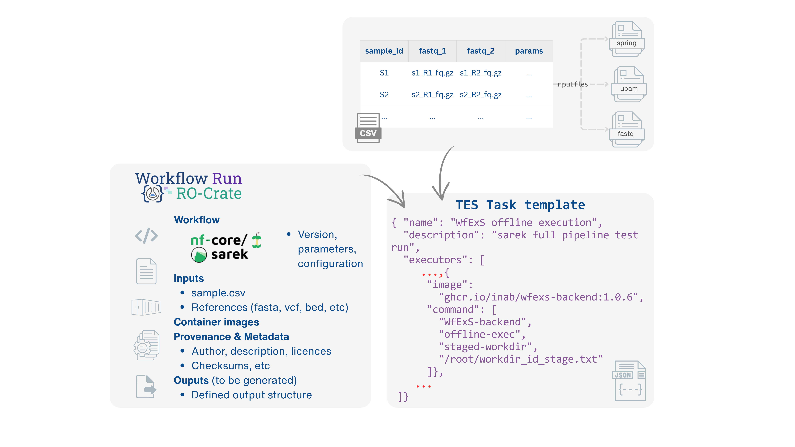

# Orchestrated containers executors

## WfExS-backend with GA4GH Task Execution Service (TES) 

[WfExS-backend](https://github.com/inab/WfExS-backend) is a workflow execution orchestrator designed to support secure, reproducible, and portable execution of computational workflows.

It simplifies the reproducibility of computational analyses. Rather than manually configuring workflow definitions, software dependencies, container images, and input datasets, researchers can reproduce a previous analysis directly from a [Workflow Run RO-Crate (WRROC)](https://www.researchobject.org/workflow-run-crate/). WfExS uses contents represented in WRROC standard to automatically reconstruct the execution environment by staging all the required components, including workflow definitions, execution parameters, container images, and reference datasets.

In this implementation, WfExS is integrated with a deployment of [Funnel](https://calypr.org/tools/funnel/), a [GA4GH TES](https://www.ga4gh.org/product/task-execution-service-tes/) service implementation. This deployment uses a customised setup, in order to allow nested container executions. WfExS itself runs as a container within the TES execution environment, where it prepares and orchestrates the execution of workflow-based analyses.


### How the WfExS executor works

The execution model is based on a clear separation of responsibilities between orchestration and execution:

- **Funnel (GA4GH TES implementation)** provides the execution environment and manages computational resources.
- **WfExS-backend** runs as a task being run within TES service, reconstructing the analysis from a WRROC, staging the required resources, and coordinating execution.
- **Workflow engines (e.g. Nextflow)** are launched by WfExS-backend, interpreting and executing computational workflows defined in a portable and reproducible manner.
- **Computational workflows [(e.g. nf-core pipeline, Sarek)](../examples-in-five-safes-tes/genomics-usecase)** define the scientific analysis logic executed on compute resources as a series of containerised tasks.


The overall execution flow is illustrated below.


## Checklist for an analysis 

Researchers have to submit a complex, raw *TES task* message, where at least one of the executors is using WfExS-backend container, in order to execute a workflow analysis. It is highly advisable to use one of the pre-prepared WfExS TES task templates, focused on specific Workflow Run RO-Crate instances.

As existing life sciences workflows usually are able to perform more than one kind of analysis, or the same one but over different organisms, all the details of a previous, successful execution should be gathered in order to increase the reproducibility of the analyses.

The format of this provenance is Workflow Run RO-Crate. So, the WRROC file associated to that kind of analysis should have captured from that previous, successful execution, both the workflow (either in Nextflow or CWL format), its internal an external dependencies, as well as the default values for the different configuration parameters of the workflow.

The WfExS TES task template must refer that WRROC, which should be available within the TRE internal storage. If the TRE allows public internet access, the WRROC referenced within the TES task template could be available in a public deposition site, like Zenodo. Also, the creator of the TES task template must describe which are the input parameters expected to be set up, like input files or detection thresholds. This is very important, to avoid unwanted changes in critical parameters of the analysis, like the location of the reference datasets or the kind of analysis. Last, but not the least important, due the complexity of workflows from [nf-core](https://nf-co.re), some preparation and marshalling steps might be needed, in the form of additional executors for the task before the execution itself.

Although it is uncommon, it could happen that more than one WfExS TES task template exists pointing to the very same WRROC instance. Typical cases would be having hardcoded some bias or threshold parameters, based on internal quality assurance standards, or having more specialised pre-processing machinery, tied to custom, non-standard input formats.

Before writing, executing a workflow using a TES task message pointing to the WfExS executor, researchers and TRE admins should ensure that:

1. A Workflow Run RO-Crate (WRROC) describing the analysis is available.
2. Required datasets and reference resources are accessible within the TRE (or already cached).
3. TES task template of the scenario, describing which parameters can be changed.
4. Any modified input parameters must be compatible with the workflow. 

Once these requirements are met, one of the executors described within the TES task can direct WfExS to reconstruct the analysis environment with the declared inputs, and submit the whole TES message through TRE infrastructure.
 



A WfExS TES task template must contain:

- a reference to a Workflow Run RO-Crate (WRROC) describing the analysis.
- execution-specific information, such as the executor configuration and any parameters that may be customised;
references to the datasets and resources available within the TRE.

Templates should be provided for each supported workflow so that researchers only need to supply the information that is intended to vary between executions.

Example of minimal TES Task Template:

```json
{
  "name": "WfExS offline execution",
  "description": "wfexs offline execution (stage)",
  "inputs": [
    {
      "name": "__workflow__",
      "description": "Workflow Run RO-Crate workflow snapshot (with pre-configured datasets)",
      "url": "URL:/path/to/WRROC",
      "path": "/container/wrroc.zip"
    },
    {
      "name": "input:1:fastq"
      "url": "URL:/path/to/INPUT",
      "path": "/data/input_1_fastq"
    },
  ],
  "outputs": [
    {
      "name": "output-wrroc",
      "description": "The WRROC which gathered the provenance of the current execution",
      "path": "/outputs/new-wrroc.zip",
      "url": "URL:/output/wrroc/path",
      "type": "FILE"
    }
  ],
  "volumes": [
    "/shared/",
    "/outputs/",
  ],
  "executors": [
    {
      "image": "ubuntu:24.04",
      "command": [
        "/bin/bash",
        "-c",
        "echo 'params:' > /shared/config.wfex.stage && echo '  input:' >> /shared/config.wfex.stage && echo '    c-l-a-s-s: File'  && echo '    preferred-name: input.fastq' && echo '    url: file:///data/input_1_fastq'"
      ],
      "workdir": "/shared",
      "stdout": "/outputs/prepare_params_stdout.log",
      "stdout": "/outputs/prepare_params_stderr.log",
      "ignore_error": false
    },
    {
      "image": "ghcr.io/inab/wfexs-backend:1.0.8",
      "command": [
        "WfExS-backend",
        "import",
        "-R",
        "/container/wrroc.zip",
        "-W",
        "/shared/config.wfex.stage",
        "-s",
        "--save-workdir-id",
        "/shared/workdir_id_stage.txt"        
      ],
      "workdir": "/shared",
      "stdout": "/outputs/import_stdout.log",
      "stdout": "/outputs/import_stderr.log",
      "ignore_error": false
    },
    {
      "image": "ghcr.io/inab/wfexs-backend:1.0.8",
      "command": [
        "WfExS-backend",
        "staged-workdir",
        "offline-exec",
        "/shared/workdir_id_stage.txt"
      ],
      "workdir": "/shared",
      "stdout": "/outputs/exec_stdout.log",
      "stdout": "/outputs/exec_stderr.log",
      "ignore_error": false
    },
    {
      "image": "ghcr.io/inab/wfexs-backend:1.0.8",
      "command": [
        "WfExS-backend",
        "staged-workdir",
        "--workflow",
        "--outputs",
        "create-prov-crate",
        "/shared/workdir_id_stage.txt",
        "/outputs/new-wrroc.zip"
      ],
      "workdir": "/shared",
      "stdout": "/outputs/prov_crate_stdout.log",
      "stdout": "/outputs/prov_crate_stderr.log",
      "ignore_error": false
    }
  ]
}


```

## Key security considerations 

- **Nested Containerisation Execution**: increased complexity to achieve the targeted isolation through FUSE encryption.
- **Workflow introspection in an isolated environment**: all the dependencies have to be provided beforehand to avoid issues.
- **Controlled filesystem access**: careless bind mount and caches might expose sensitive unencrypted host data if not controlled.
- **Secret management**: how to perform the proper key exchanges needed to decrypt contents on the fly, or safely encrypt results before they are exported.
- **Temporary writable storage**: it should be encrypted to avoid leakages.
- **Persistent tracking & metadata**: accountability must be performed wherever it is possible.

## Provenance and RO-Crate model

