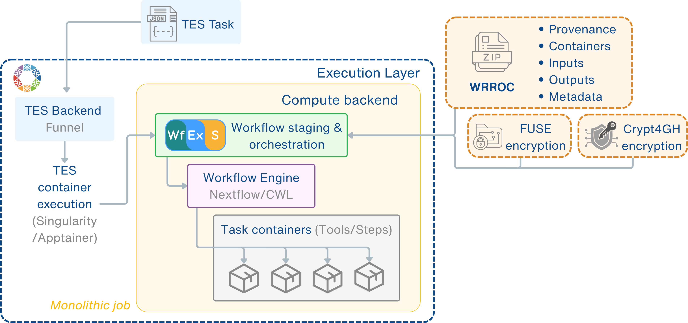
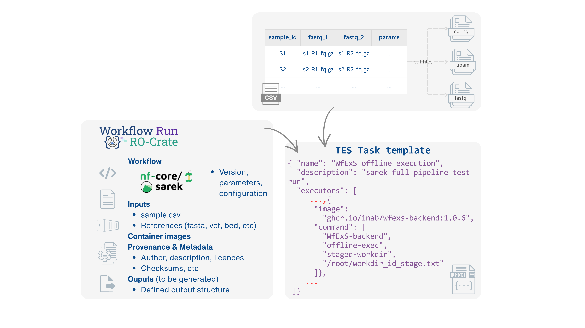

# Orchestrated containers executors

## WfExS-backend with GA4GH Task Execution Service (TES) 

[WfExS-backend](https://github.com/inab/WfExS-backend) is a workflow execution orchestrator designed to support secure, reproducible, and portable execution of computational workflows.

It simplifies the reproducibility of computational analyses. Rather than manually configuring workflow definitions, software dependencies, container images, and input datasets, researchers can reproduce a previous analysis directly from a [Workflow Run RO-Crate (WRROC)](https://www.researchobject.org/workflow-run-crate/). WfExS uses contents represented in WRROC standard to automatically reconstruct the execution environment by staging all the required components, including workflow definitions, execution parameters, container images, and reference datasets.

In this deployment, WfExS is integrated with an instance of [Funnel](https://calypr.org/tools/funnel/), a [GA4GH TES](https://www.ga4gh.org/product/task-execution-service-tes/) service implementation. This deployment uses a customised setup, in order to allow nested container executions. WfExS v1.0.9 itself runs as a container within the TES execution environment, where it prepares and orchestrates the execution of workflow-based analyses.
Future developments will allow spawning these inner jobs in the very same or a different TES environment, increasing the technical scalability. 

### How the WfExS executor works

The execution model is based on a clear separation of responsibilities between orchestration and execution:

- **Funnel (GA4GH TES implementation)** provides the execution environment and manages computational resources.
- **WfExS-backend** runs as a task being run within TES service, reconstructing the analysis from a WRROC, staging the required resources, and coordinating execution.
- **Workflow engines (e.g. Nextflow)** are launched by WfExS-backend, interpreting and executing computational workflows defined in a portable and reproducible manner.
- **Computational workflows [(e.g. nf-core pipeline, Sarek)](../examples-in-five-safes-tes/genomics-usecase)** define the scientific analysis logic executed on compute resources as a series of containerised tasks.

The overall execution flow is illustrated below.

## Checklist for an analysis 

Before submitting an analysis, researchers should ensure that the required analysis resources and execution environment are available. Most of these are expected to be provided by the TRE.

**1. Select the analysis to reproduce**

Researchers should first identify the analysis scenario they wish to execute from a catalogue of pre-approved analyses, each corresponding to a validated workflow execution (for example, different workflows, organisms, reference datasets, or analysis types).

Each analysis is represented by a WRROC, which captures the complete description of a previously successful anlaysis execution. This includes the workflow definition (e.g. Nextflow or CWL), software dependencies, execution environment, provenance information, and the default workflow parameters required to reproduce the analysis.

A single workflow may support multiple analysis scenarios. Consequently, several WRROCs may exist for the same workflow, each describing a different validated analysis. 

As an example, the [WRROC](https://zenodo.org/records/21134855) used throughout the [genomics use case](../examples-in-five-safes-tes/genomics-usecase) is publicly available through Zenodo.

**2. TES task message**

Workflow analyses are submitted to the TRE as TES task messages. Because these messages contain the execution configuration required by the infrastructure, TREs are expected to provide TES task templates for each supported analysis.

The template references the selected WRROC and defines which workflow parameters may be modified by the researcher (for example, input datasets, sample sheets, output locations or analysis thresholds). Any modified parameters must remain compatible with the selected workflow and analysis scenario. Critical execution settings, such as the workflow version or reference datasets should normally remain unchanged unless explicitly permitted by the TRE.

Templates should be provided for each supported analysis so that researchers only need to supply the information that is intended to vary between executions.

A dedicated section on WfExS [TES task message templates](./5s-tes-messages) describes the structure of these templates in more detail.

**3. Required datasets and reference resources**s

Researchers should ensure that all required datasets and reference resources are available within the TRE before submitting the analysis. The TRE is expected to provide a catalogue of approved datasets, reference resources, and their corresponding locations (e.g. internal URLs or identifiers) that can be referenced from the TES task.

Once these requirements have been satisfied, the TES task can be submitted for execution.

**Additional considerations**

- Although uncommon, more than one TES task template may reference the same WRROC. This typically occurs when different execution environments, organisation-specific quality assurance procedures, or specialised preprocessing steps are required while preserving the same underlying workflow execution.

- Due to the complexity of workflows such as those developed by nf-core, additional preparation or marshalling steps may be required before the workflow itself is executed. These steps are typically implemented as additional executors within the TES task and are already included in the templates provided by the TRE.

## Results of an analysis execution

Once an analysis has completed successfully, researchers receive the analysis results together with the information required to verify, reproduce, and reuse the workflow execution.

- **Workflow outputs:** the files generated by the analysis (e.g. reports, result files, and intermediate outputs selected for preservation).
- **Execution logs:** logs produced during the execution, which can be used to monitor progress, troubleshoot issues, or verify that the workflow completed successfully.
- **Workflow Run RO-Crate (WRROC):** a machine-readable package describing the execution. The WRROC captures the workflow definition, input parameters, software containers, datasets and reference resources used, execution environment, generated outputs, and associated metadata required to reproduce or reuse the analysis.

## Security considerations 

Researchers should be aware of the following aspects:

- **Nested Containerisation Execution**: increased complexity to achieve the targeted isolation through FUSE encryption.
- **Workflow introspection in an isolated environment**: all software dependencies, containers, and workflow resources must be available before execution to avoid issues.
- **Controlled filesystem access**: careless bind mount and caches might expose sensitive unencrypted host data if not controlled.
- **Secret management**: how to perform the proper key exchanges needed to decrypt contents on the fly, or safely encrypt results before they are exported.
- **Temporary writable storage**: it should be encrypted to avoid leakages.
- **Persistent tracking & metadata**: accountability must be performed wherever it is possible.

